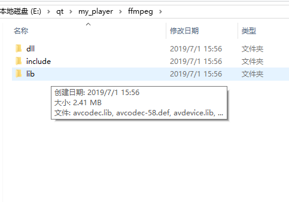

#Windos下基于qt的ffmpeg+sdl2.0环境搭建

标签（空格分隔）： 未分类

---
### 概述
sdl介绍
SDL（Simple DirectMedia Layer）是一套开放源代码的跨平台多媒体开发库，使用C语言写成。SDL提供了数种控制图像、声音、输出入的函数，让开发者只要用相同或是相似的代码就可以开发出跨多个平台（Linux、Windows、Mac OS X等）的应用软件。目前SDL多用于开发游戏、模拟器、媒体播放器等多媒体应用领域。
SDL使用GNU宽通用公共许可证为授权方式，意指动态链接（dynamic link）其库并不需要开放本身的源代码。因此诸如《雷神之锤4》等商业游戏也使用SDL来开发。

### 下载ffmpeg+SDL 静态库
下载ffmpeg [ffmpeg地址](https://ffmpeg.zeranoe.com/builds/)

分别下载Shared和Dev
Dev中包含了头文件以及lib库文件
shared中包含了ffmpeg的dll文件

下载SDL2.0静态库 [sdl2.0地址](http://www.libsdl.org/download-2.0.php)


### 添加到工程目录下
在工程中新建ffmpeg、SDL文件夹，分别从拷贝对应的lib文件以及头文件和dll文件到对应的目录下如下图：


### 添加动态库到工程中
在工程中的xxx.pro中添加动态库方法如下：
```
INCLUDEPATH += ./ffmpeg/include

linux: LIBS +=
win32: LIBS += -L$$PWD/ffmpeg/lib/ -lavcodec -lavdevice -lavfilter -lavformat -lavutil -lpostproc -lswresample -lswscale

INCLUDEPATH += $$PWD/SDL2.0/include

linux: LIBS +=
win32: LIBS += -L$$PWD/SDL2.0/lib/x86/ -lSDL2 -lSDL2main -lSDL2test
```
将ffmpeg的dll文件copy至编译出来的.exe的目录下

#### 测试代码
ffmpeg测试
```
qDebug()<<"hello world!\n";
qDebug()<<avcodec_configuration();
```
打印结果

sdl测试
能够显示一张BMP图片
```
SDL_Window *gwindows =NULL;
    SDL_Surface *gScreenSurface = NULL;
    SDL_Surface *gHelloworld =NULL;

    if(SDL_Init(SDL_INIT_VIDEO) < 0)
    {
        qDebug()<<"Windows could not created SDL_ERROR:" << SDL_GetError()<<"\n";
        return -1;
    }

    gwindows = SDL_CreateWindow("SHOW BMP",
                                SDL_WINDOWPOS_UNDEFINED,
                                SDL_WINDOWPOS_UNDEFINED,
                                SCREEN_WIDTH,
                                SCREEN_HEIGHT,
                                SDL_WINDOW_SHOWN);
    if(gwindows == NULL)
    {
        qDebug()<< "Windows could not created SDL_ERROR:" << SDL_GetError()<<"\n";
        return -1;
    }
    gScreenSurface = SDL_GetWindowSurface(gwindows);

    gHelloworld = SDL_LoadBMP(image_path);

    if(gHelloworld == NULL)
    {
        qDebug()<< "Unable load image:" << "SDL_ERROR"<<SDL_GetError()<<"\n";
        return -1;
    }

    SDL_BlitSurface(gHelloworld,NULL,gScreenSurface, NULL);
    SDL_UpdateWindowSurface(gwindows);

    SDL_Delay(2000);

    SDL_FreeSurface(gHelloworld);
    gHelloworld = NULL;

    SDL_DestroyWindow(gwindows);
    gwindows = NULL;

    SDL_Quit();
```
显示效果


